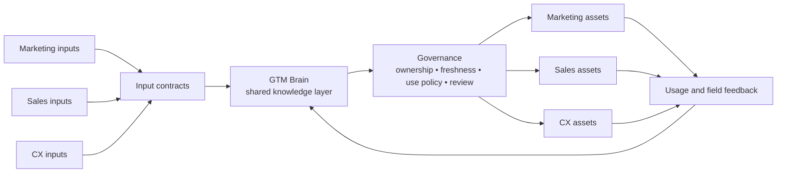

# GTM Brain

**A GTM Knowledge Operations blueprint for turning fragmented Marketing, Sales, and CX inputs into governed shared knowledge and reusable team assets.**

Marketing, Sales, and CX teams often investigate the same customers, markets, competitors, product questions, and objections in separate systems. That fragmentation creates duplicated research, inconsistent messaging, and weak handoffs.

GTM Brain is the shared knowledge layer at the center of the operating model. It captures each team’s inputs, structures the common evidence and decisions, and projects the same governed knowledge into team-specific assets.

> This repository is a static skeleton and reference architecture. It intentionally contains no runnable demo, production connectors, customer data, model integration, or deployment code.

## Problem

GTM knowledge is usually distributed across campaign reports, research notes, CRM activity, call summaries, support themes, onboarding observations, and renewal conversations. Each team can have a useful local view while the company lacks one reusable, traceable view.

The result is predictable:

- teams repeat research that another team has already completed;
- customer and market signals are interpreted differently;
- claims and messages drift by channel and owner;
- useful Sales and CX learning does not consistently return to Marketing;
- downstream assets become stale because their evidence and owners are unclear.

## What GTM Brain is

GTM Brain is a shared knowledge operating layer, not another system of record.

It defines:

- how Marketing, Sales, and CX inputs enter a common structure;
- how sources remain separate from evidence, insights, claims, and approved messages;
- how ownership, freshness, sensitivity, and external-use policy are recorded;
- how the same governed knowledge becomes reusable assets for each team;
- how field and customer feedback updates the shared knowledge over time.

## System model



The repository expresses this model through schemas, source manifests, lifecycle scaffolding, reusable templates, and clearly labeled illustrative outputs.

## Shared knowledge

GTM Brain separates eight record types so that an observation is not mistaken for an approved message and an asset is not mistaken for its evidence.

| Record | Purpose |
|---|---|
| Source | Captures provenance, owner, freshness, sensitivity, and use policy. |
| Evidence | Records a traceable observation or statement from a source. |
| Audience | Defines a reusable buyer, user, customer, account, or segment context. |
| Insight | Captures an evidence-backed interpretation, including contradictions and gaps. |
| Claim | Stores an assertion with support, boundaries, and allowed uses. |
| Message | Stores reusable language linked to claims, insights, audiences, and review. |
| Asset | Projects governed knowledge into a Marketing, Sales, or CX deliverable. |
| Review | Records a separate approval, requested change, rejection, or retirement decision. |

The [knowledge model](docs/knowledge-model.md), [governance model](docs/governance.md), and [taxonomy](docs/taxonomy.md) define the complete contracts.

## Team outputs

The shared knowledge layer supports equal first-class output families.

| Marketing | Sales | CX |
|---|---|---|
| Content brief | Account research brief | Voice-of-customer summary |
| Campaign brief | Discovery guide | Onboarding brief |
| Positioning brief | Objection handling | Adoption risk brief |
| Voice-of-customer brief | Competitive battlecard | Renewal and expansion brief |

Shared templates also support research synthesis, messaging foundations, evidence registers, and knowledge-gap tracking.

## Repository map

```text
docs/       System architecture, knowledge model, governance, workflows, and taxonomy
schemas/    Static contracts for source, evidence, audience, insight, claim, message, asset, and review records
scaffold/   Team input manifests, linked knowledge examples, lifecycle policy, and logical workflow map
templates/  Reusable shared, Marketing, Sales, and CX asset templates
examples/   Illustrative outputs showing one knowledge chain projected across teams
scripts/    Repository content-integrity validation only
```

## Scope

This repository shows the structure and operating model of a GTM Knowledge Operations system.

It does not implement source connectors, storage, retrieval, generation, publication, access control, collaboration, analytics, or deployment. It does not contain customer evidence or claim business outcomes. Future implementations can choose those technologies while preserving the contracts and team workflows defined here.
