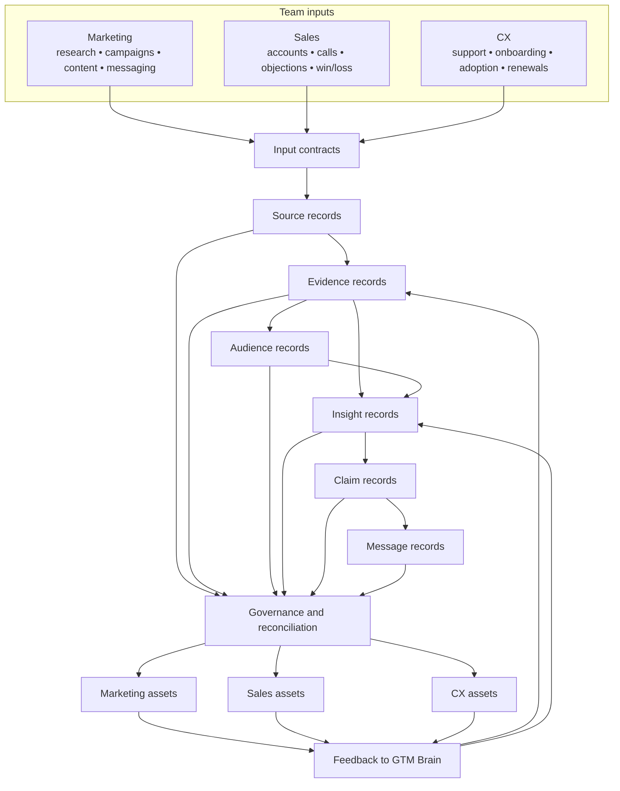

# Architecture

## Purpose

GTM Brain is the shared knowledge layer in a GTM Knowledge Operations system. The architecture defines how Marketing, Sales, and CX inputs become common governed knowledge and then become reusable assets for each team.

This document describes logical boundaries only. It does not prescribe an implementation language, storage engine, retrieval approach, model provider, connector framework, workflow engine, interface, or deployment platform.

## Logical flow

## Layer 1 — Team inputs

Each team contributes source classes that already exist in its operating environment.

Marketing contributes market research, campaign and content performance, web and conversion signals, brand guidance, and customer-language research.

Sales contributes account and opportunity notes, call observations, objections, discovery patterns, win/loss findings, and competitive intelligence.

CX contributes support themes, onboarding observations, product-adoption signals, voice-of-customer feedback, and renewal or expansion findings.

The repository does not define a connector. It defines the metadata a connector, export, or curated manual process must produce.

## Layer 2 — Input contracts

A team source manifest describes:

- the source class;
- owner;
- system of record;
- canonical location;
- expected capture mode and cadence;
- expected content types and fields;
- sensitivity;
- external-use policy;
- knowledge domains.

A Source record then represents one captured source in the shared model.

The input boundary must preserve source ownership and restrictions. Normalization must not make a source less sensitive or more externally reusable.

## Layer 3 — Shared knowledge

The shared layer has eight record types.

### Source

Provenance and administrative context.

### Evidence

A traceable observation or statement from a Source. Evidence should be specific enough to inspect and narrow enough to reuse without overstating the source.

### Audience

A reusable description of a buyer, user, customer, account, or segment. Audience records prevent each team from redefining the same role independently.

### Insight

An interpretation supported by Evidence. An Insight may combine evidence from more than one team and must expose contradictions and gaps.

### Claim

An assertion that may be used in downstream communication. A Claim defines support, allowed uses, prohibited uses, status, and external-use policy.

### Message

Reusable language adapted to an Audience and use case. Approved Messages must link to Claims and remain separately reviewable.

### Asset

A downstream Marketing, Sales, or CX deliverable. An Asset records its complete lineage and does not become an independent source of truth.

### Review

A separate decision record. Review remains distinct from the content being reviewed.

## Layer 4 — Reconciliation and governance

Reconciliation is the operating process that turns team-local observations into shared knowledge.

It includes:

- identifying duplicate sources and evidence;
- mapping team-specific vocabulary to the shared taxonomy;
- preserving conflicting evidence;
- deciding whether an interpretation is an Insight or still a gap;
- deciding whether a Claim is supported;
- approving or retiring reusable Messages;
- assigning owners and review dates;
- ensuring restrictions flow into Assets.

Governance fields are present in the schemas. Enforcement mechanics are outside this repository.

## Layer 5 — Team projections

GTM Brain does not produce one generic output. It projects the same shared records into team-specific formats.

Marketing uses the knowledge to frame audiences, positioning, campaigns, content, and customer language.

Sales uses it to prepare account research, discovery, objection responses, and competitive guidance.

CX uses it to synthesize customer signals, plan onboarding, manage adoption risk, and prepare renewal or expansion work.

Every template carries source, evidence, insight, claim, and message references so a team asset can be traced back to shared knowledge.

## Layer 6 — Feedback loop

Team usage generates new evidence.

Examples include:

- a message repeatedly misunderstood in Sales conversations;
- a campaign angle that attracts the wrong audience;
- an onboarding issue that contradicts a product assumption;
- a renewal concern that reveals a missing objection;
- a customer phrase that should update approved language.

Templates therefore include a `Feedback to GTM Brain` section. That feedback is converted into new or updated records through the same Source, Evidence, Insight, Claim, Message, and Review lifecycle.

## Ownership boundary

GTM Brain has one cross-functional owner and one steward per team.

The cross-functional owner controls shared taxonomy, conflicts, lifecycle policy, and cross-team decisions.

Team stewards control source intake quality and ensure local outputs retain lineage.

Domain owners approve or retire Claims and Messages.

Asset owners maintain downstream outputs and their review dates.

## Data boundary

The public repository uses placeholders only.

A real implementation must decide where sensitive source content lives and which fields may be copied into shared records. The public schemas should be treated as a minimum contract, not permission to centralize restricted data.

## Implementation boundary

The architecture intentionally leaves these choices open:

- source connector or export method;
- raw-content storage;
- document parsing;
- search or retrieval;
- databases;
- eventing and orchestration;
- model-assisted synthesis;
- user interface;
- access control;
- audit logging;
- deployment and monitoring.

A future implementation is aligned only when it preserves the record distinctions, policy propagation, ownership, lineage, team parity, and feedback loop defined here.
